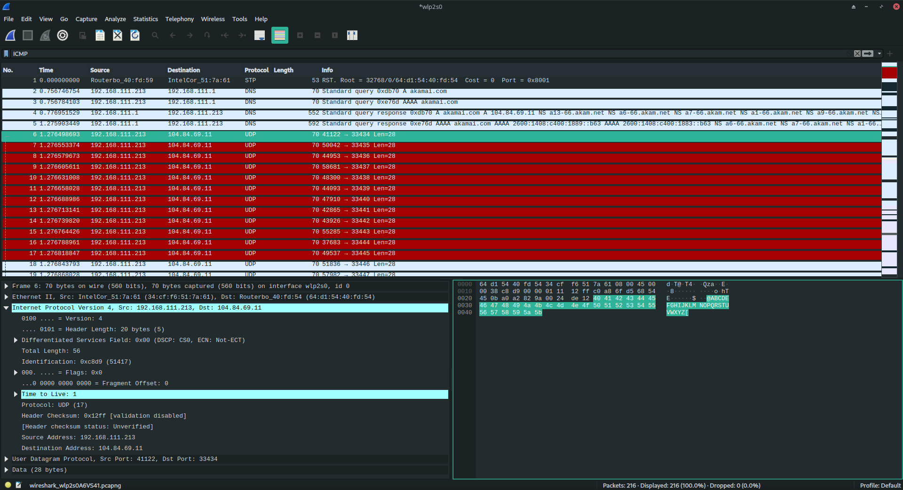
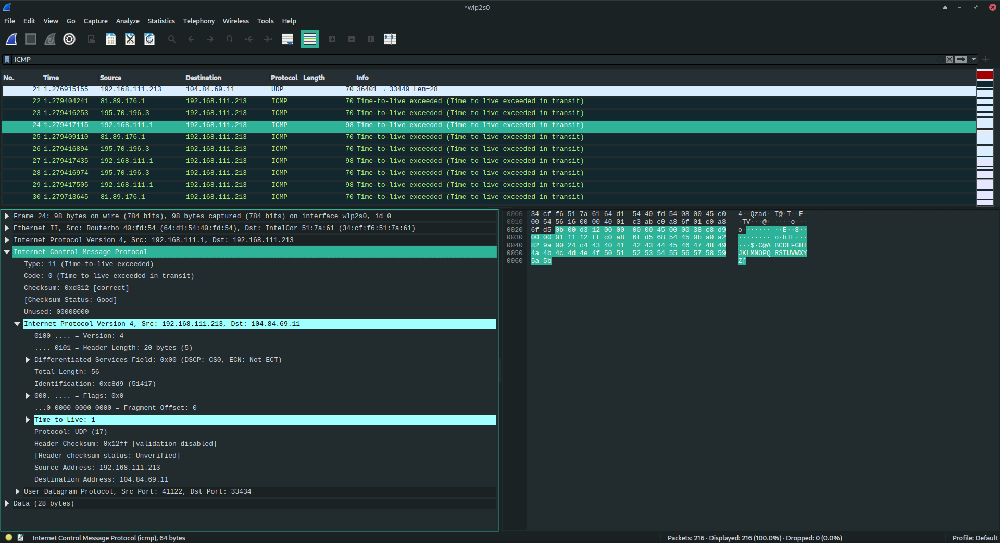
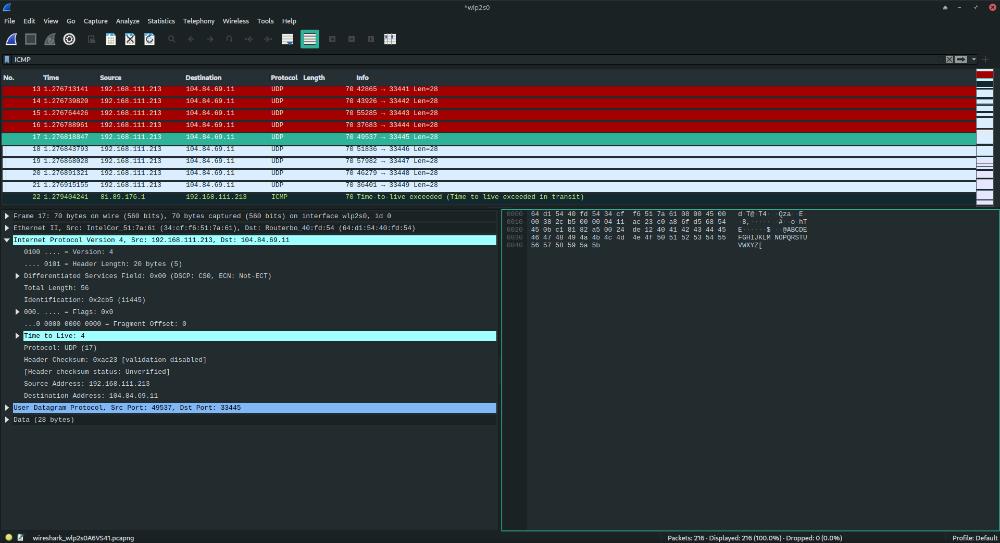
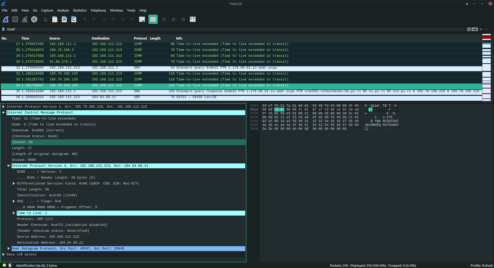
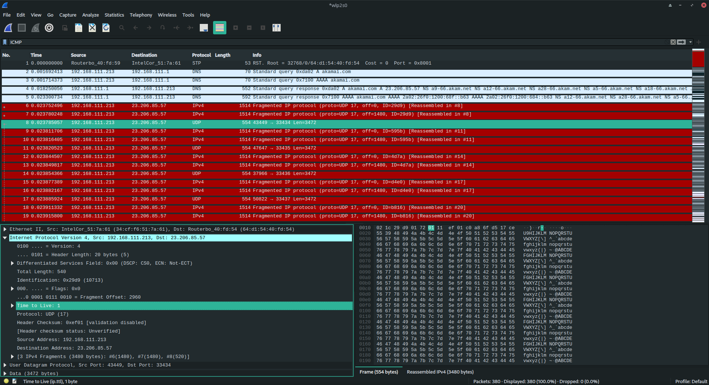

# 1. WIRESHARK IP

### 1

IP-адрес моего компьютера в локальной сети - `192.168.111.213`

### 2

Протокол верхнего уровня 17(UDP)

### 3

Размер IP-заголовка 20 байт

### 4

Мой компьютер не отсылал ICMP сообщений вообще, думаю речь идёт об UDP

a) Меняются значения `Time to Live`, `Identification`, `Header Checksum`

б) Не меняются версия IP, длина заголовка и всей дейтагарммы, всякие флаги, протокол, адрес отправителя и получателя, fragment offset. Они и не должны менятся. Менятся должны `Time to Live`, `Identification`, `Header Checksum`.

в) Значение `Identification` уникальное для каждого сообщения, я не вижу закономерности

### 5

В запросе

`Identification: 0xc8d9 (51417)`

`Time to Live: 1`

### 6

В ответе с первого маршрутизатора

`Identification: 0xc8d9 (51417)`

`Time to Live: 1`

### 7

В запросе

`Identification: 0x2cb5 (11445)`

`Time to Live: 4`

В ответе

`Identification: 0x2cb5 (11445)`

`Time to Live: 4`

### 7

a) Сообщение было фрагментировано на 3 части

б) Теперь из-за фрагментации изменяются `Total Length`, `.Fragment Offset` и флаг отвечающий за то, что данная дейтаграма является последним фрагментом

