# Часть 2
## A
### 1

`175.45.176.67` - IP адрес сайта по организации туризма в КНДР. 

```
[vladimir@vladimir-zenbook ~]$ nslookup www.tourismdprk.gov.kp
Server:		192.168.111.1
Address:	192.168.111.1#53

Non-authoritative answer:
Name:	www.tourismdprk.gov.kp
Address: 175.45.176.67
```
### 2

`dns.jacobs-university.de` - авторитетный DNS сервер `constructor.university`

```
[vladimir@vladimir-zenbook ~]$ nslookup -type=ns constructor.university
Server:		192.168.111.1
Address:	192.168.111.1#53

Non-authoritative answer:
constructor.university	nameserver = www.jacobs-utils.de.
constructor.university	nameserver = dns.jacobs-university.de.

Authoritative answers can be found from:
constructor.university	nameserver = dns.jacobs-university.de.
constructor.university	nameserver = www.jacobs-utils.de.
www.jacobs-utils.de	internet address = 81.169.212.166
dns.jacobs-university.de	internet address = 212.201.44.22
dns.jacobs-university.de	internet address = 212.201.44.22
www.jacobs-utils.de	internet address = 81.169.212.166
```
### 3

`spbu.ru` - 1 ip4-адрес `81.89.183.222`

`ya.ru` - 2 ip4-адреса `5.255.255.242`, `77.88.55.242` и ip6 адрес `2a02:6b8::2:242`

```
[vladimir@vladimir-zenbook ~]$ nslookup spbu.ru
Server:		192.168.111.1
Address:	192.168.111.1#53

Non-authoritative answer:
Name:	spbu.ru
Address: 81.89.183.222

[vladimir@vladimir-zenbook ~]$ nslookup ya.ru
Server:		192.168.111.1
Address:	192.168.111.1#53

Non-authoritative answer:
Name:	ya.ru
Address: 5.255.255.242
Name:	ya.ru
Address: 77.88.55.242
Name:	ya.ru
Address: 2a02:6b8::2:242
```

## Б

1) Протокол - UDP
2) Порт 53
3) Запрос отправлен на `195.70.196.210`, это не мой локальный DNS-сервер, мой локальный - `192.168.111.1`
4) Запись типа A, никаких ответов нет
5) 3 ответа. Canonical name и 2 ip-адреса сервиса
6) Да, соответствует `104.16.45.99`
7) Да, запрашивается адрес `analytics.ietf.org` 

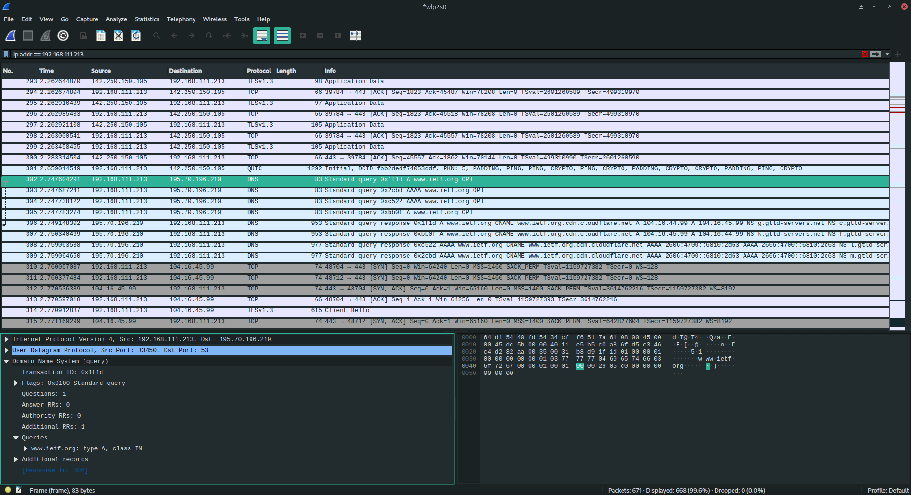
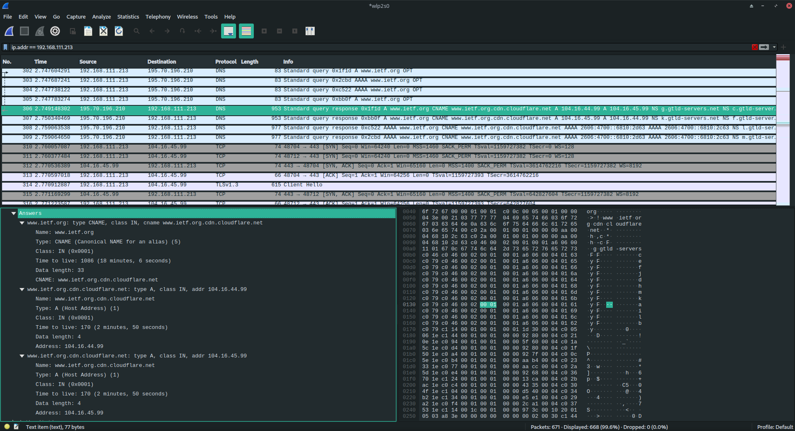

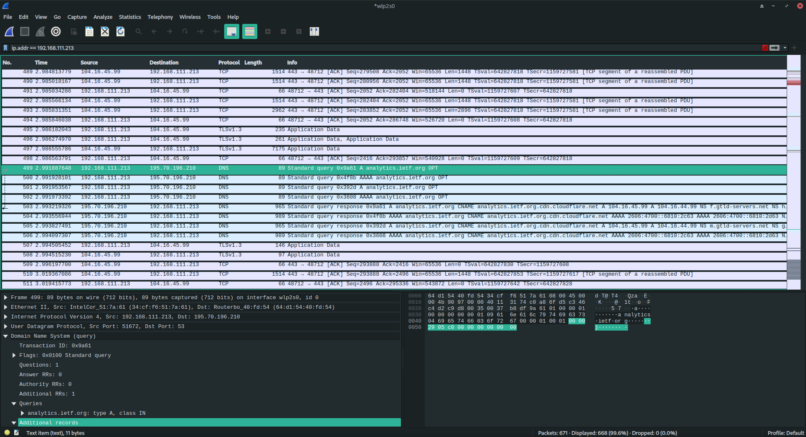

## В

1) Порт 53
2) `192.168.111.1`, да совпадает
3) Запрашивается тип AAAA, ответов нет
4) 2 NameServer'a, и 2 ip-адреса этого nameserver'а

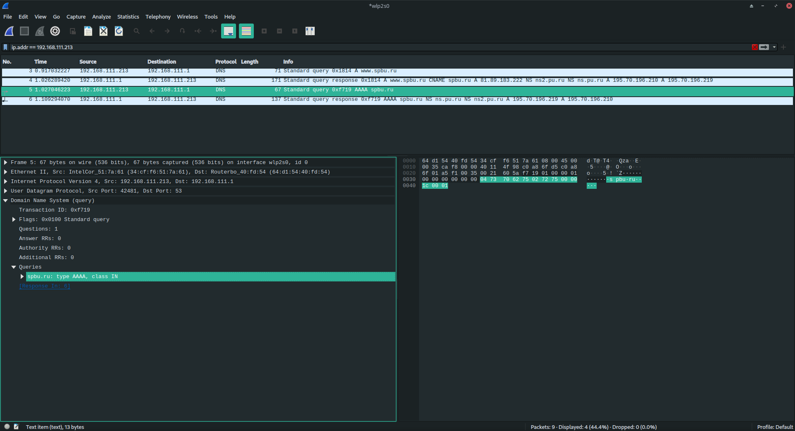
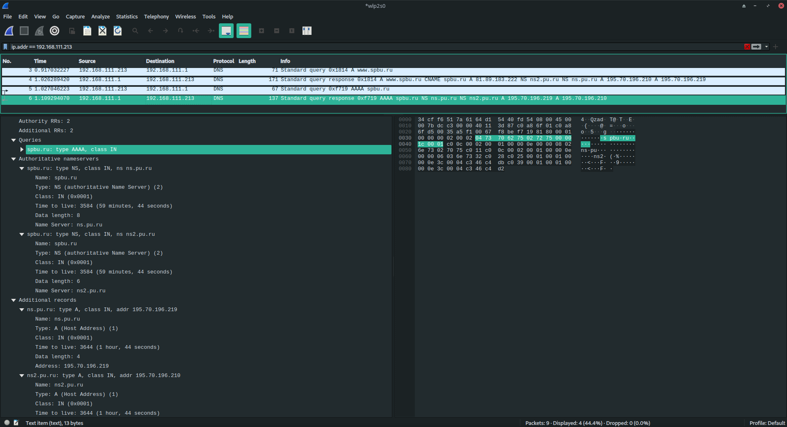

## Г

1) `192.168.111.1`, да совпадает
2) Запрашивается тип NS, ответов нет
3) Каноничное имя, 4 именных сервера(nameserver) и 5 их ip-адресов

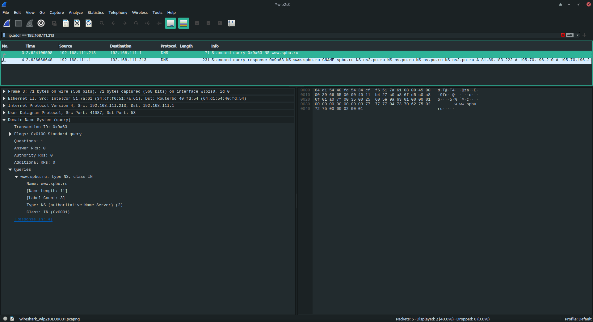
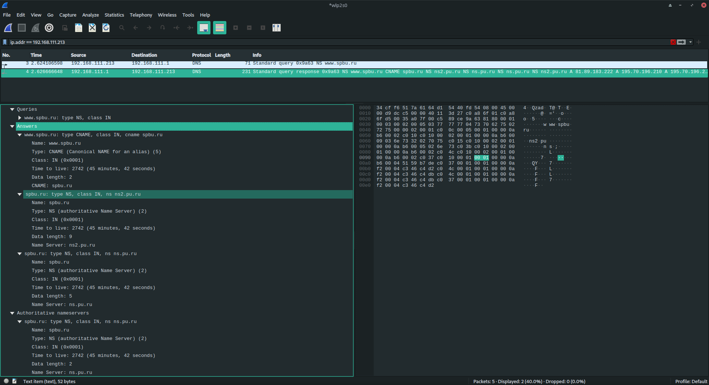
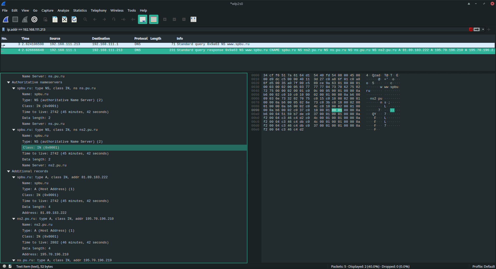
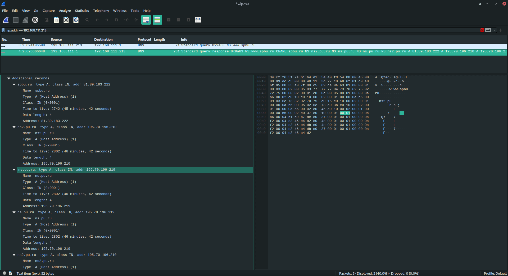

## Д

1) Запрос отправлен на `195.70.196.210`, это не мой локальный DNS-сервер, мой локальный - `192.168.111.1`
2) Запрашивается тип AAAA, ответов нет
3) Type: SOA (Start Of a zone of Authority) (6)

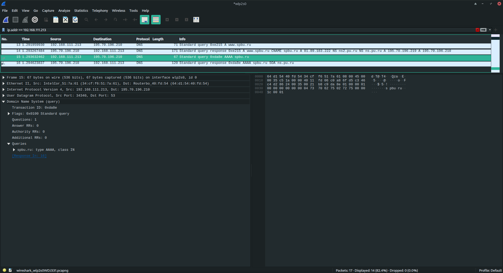
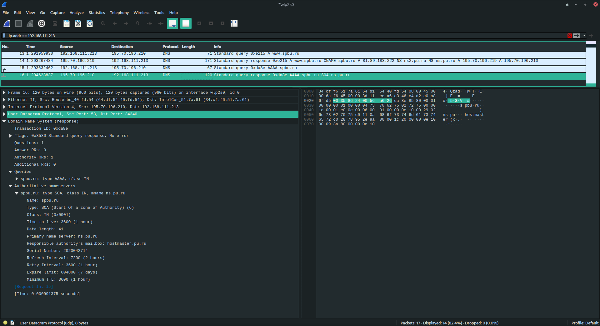

## Е

1) WHOIS – это база данных, в которой хранятся сведения о доменах
2) Я использовал https://www.nic.ru/whois/ - для ya.ru я нашёл 2 dns-сервера: `ns.pu.ru` и `ns2.pu.ru `
3) 

```
[vladimir@vladimir-zenbook ~]$ nslookup kpnn.ru
Server:		192.168.111.1
Address:	192.168.111.1#53

Non-authoritative answer:
Name:	kpnn.ru
Address: 5.189.198.226

[vladimir@vladimir-zenbook ~]$ nslookup kpnn.ru ns.pu.ru
Server:		ns.pu.ru
Address:	195.70.196.219#53

Non-authoritative answer:
Name:	KPNN.ru
Address: 5.189.198.226

[vladimir@vladimir-zenbook ~]$ nslookup kpnn.ru ns2.pu.ru
Server:		ns2.pu.ru
Address:	195.70.196.210#53

Non-authoritative answer:
Name:	kpnn.ru
Address: 5.189.198.226
```

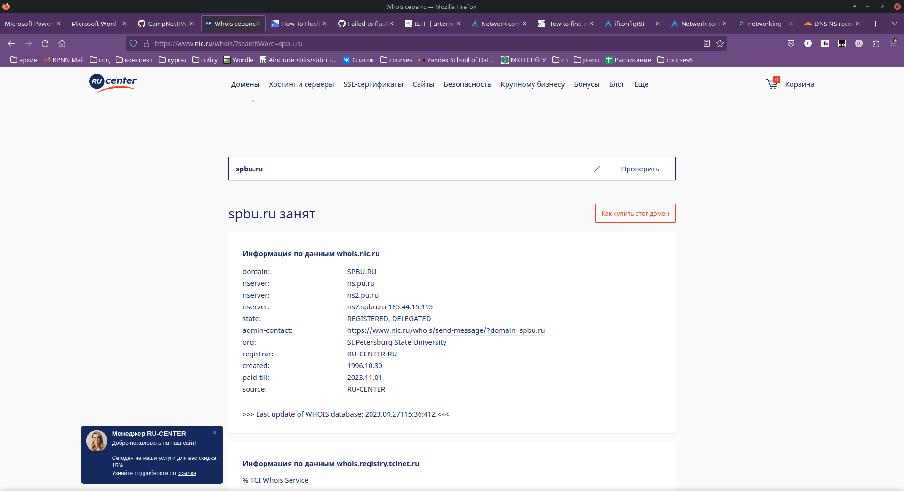
