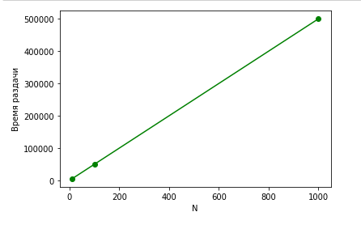
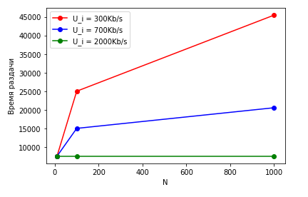

# 1. Программочки

## Программа 3

Смотреть файлы `task3_server.py` и `task3_client.py`

# 2. Задачки

## Задание 1

### A

На каждый пакет с данными прийдётся отправлять ещё 4 технических пакета, 2 на рукопожатие 1 на запрос и 1 на закрытие

рукопожатие + запрос + ответ + закрытие

Кол-во бит на объект $L = 200*2 + 200 + 100000 + 200 = 100800$

Количество пакетов на объект $k = 1*2 + 1 + 1 + 1 = 5$

Скорость канала на пользователя $S = 150 / 10 = 15$

Время на один объект $\frac{L} {S} + k * \frac{10}{300*10^6} = 6720$ с

Сумарное время $ 6720 * 11 = 73920 $ c

### Б

Для установки соединения 3 пакета: 2 рукопожатие, 1 закрытие

На каждый пакет с данными прийдётся отправлять 1 технический пакет на запрос

Кол-во бит на объект $L = 200 + 100000 = 100200$

Количество пакетов на объект $k = 2$

Скорость канала на пользователя $S = 150 / 10 = 15$

Время на один объект $\frac{L} {S} + k * \frac{10}{300*10^6} = 6680$ с

Сумарное время $ 6720 * 11 + \frac{2 * 200} {15} + 3 * \frac{10}{300*10^6} = 73520 $ c

Нет существенного преимущества в постояном HTTP соединении

## Задание 2

При клиент-серверной архитектуре скорость отдачи пользователя не важна, поэтому один график

При одноранговой несколько графиков

## Задание 3

### A 

У нас каждый клиент загружает данные быстрее чем их может отгружать сервер. Сервер узкое место, поэтому общее время раздачи $NF / u_s$

### Б

У нас самый медленный клиент принимает данные медленнее, чем ему может отаравлять серевер. Медленный клиент узкое место, поэтому общее время раздачи $F / d_{min}$

### В

По заврешении раздачи все данные с сервера должны быть отправлены, а всеми клиентами получены. Сервер отправит все данные не раньше чем $NF / u_s$, а все клиенты получат не ранее $F / d_{min}$

Значит время раздачи $\le \max (NF / u_s, F / d_{min})$