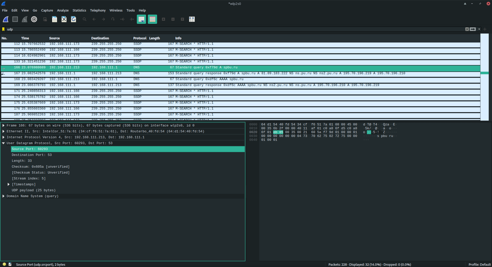
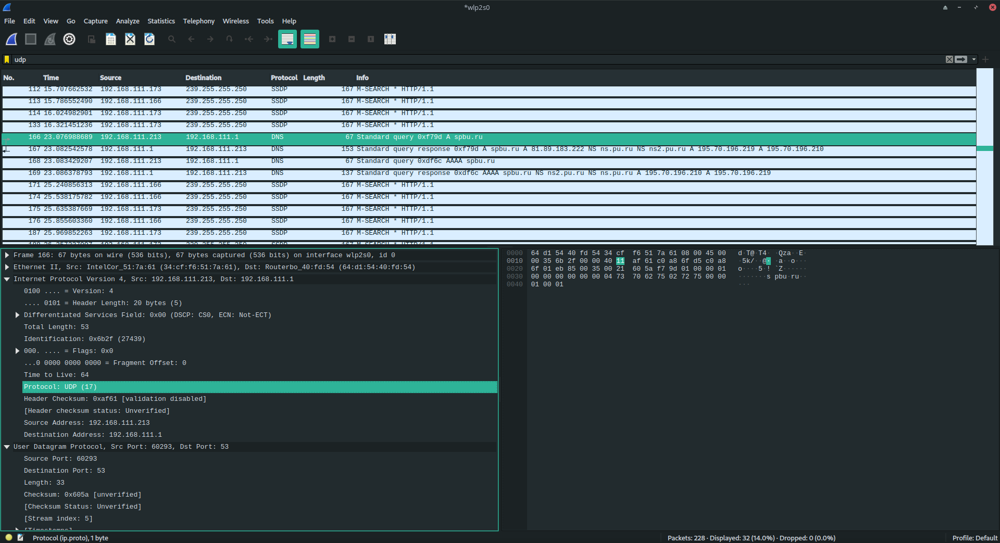

# 1. Wireshark: UDP (5 баллов)

### 1) 

Я запустил сниффер пакетов и зпаустил `nslookup spbu.ru`, 4 поля: `Source Port: 60293`, `Destination Port: 53`,  `Length: 33`,  `Checksum: 0x605a [unverified]`

### 2) 

`Source Port` - 2 байта, 

`Destination Port` - 2 байта, 

`Length` - 2 байта, 

`Checksum` - 2 байта

### 3)

Длина это длина заголовка 8 байт + сообщение(`UDP payload`) 25 байт

### 4)

Поле `Length` - 2-х байтное. Максимальное значение - 65535, но 8 байт уходит на заголовок и на полезную нагрузку остаётся 65527 байт

### 5)

Поля для портов также 2-х байтные

### 6)

`Protocol: UDP (17)`

17 порт в десятиричной системе

11 порт в шестнадцатиричной

### 7)

Запрос `User Datagram Protocol, Src Port: 60293, Dst Port: 53`

Ответ `User Datagram Protocol, Src Port: 53, Dst Port: 60293`

# 2. Программирование. FTP

## 1. FileZilla сервер и клиент (3 балла)

Далее скриншоты того, как я потыкался в FTP сервер с клиента

.png)

.png)

.png)

.png)

.png)

.png)

.png)

.png)

.png)

## 2. FTP клиент (3 балла)

Решение в файле `ftpclient.py`

`all`

`upload <filename>` 

`download <filename>`

`quit`

`exit`
