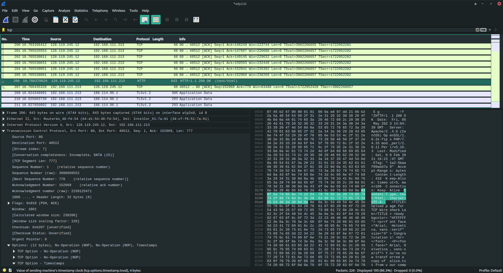
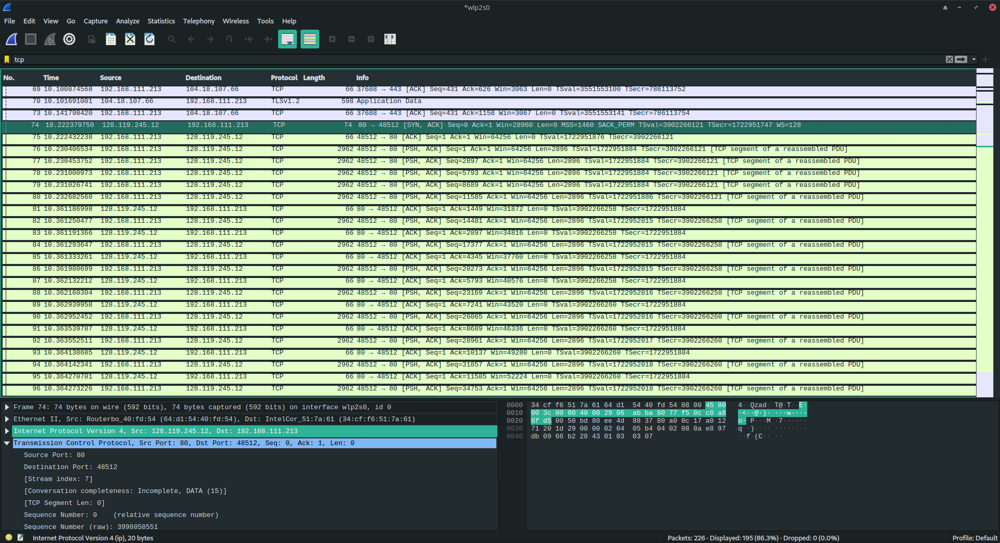
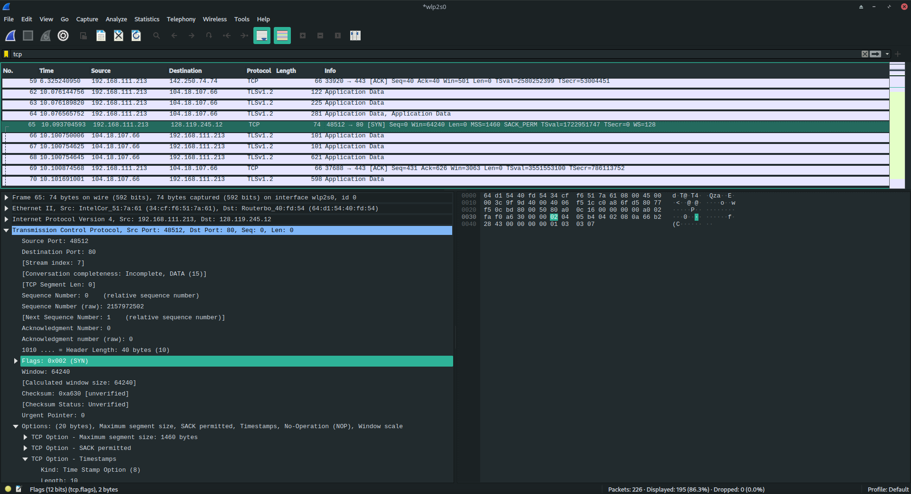
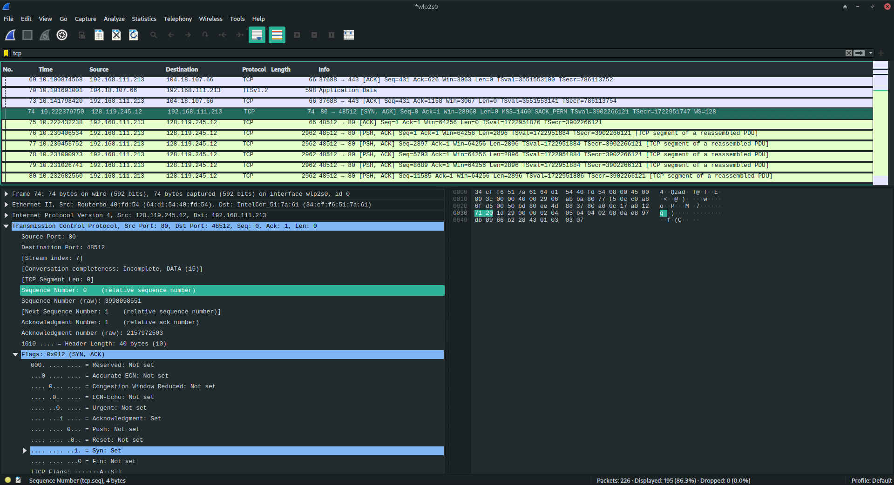
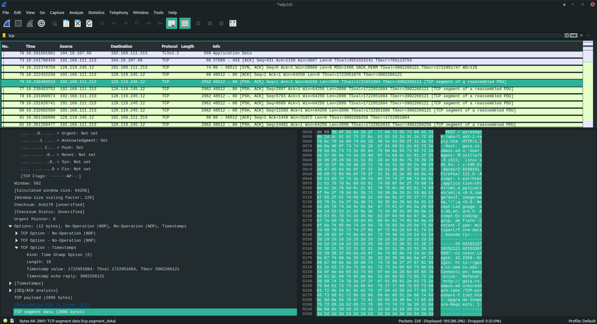
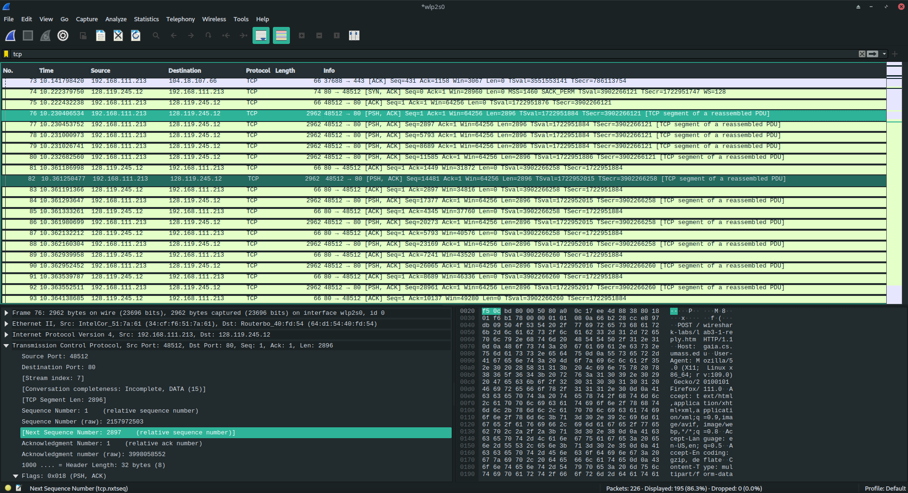
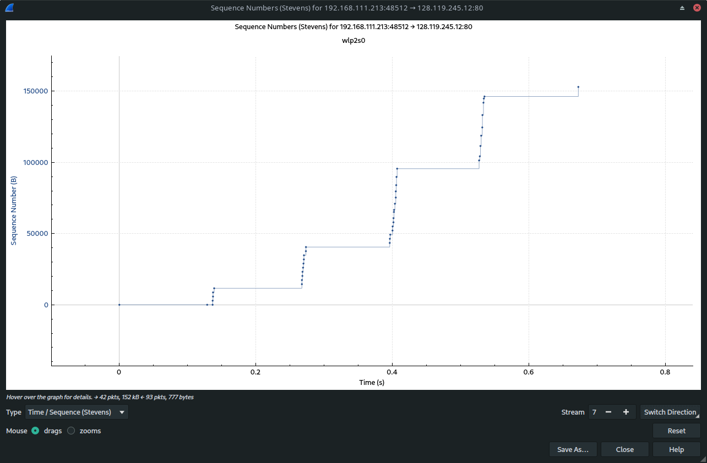

# 1. WireSharck: TCP

## 1. Перехват TCP

### 1) 

Порт на моём компьютере `48512`

### 2)

IP-адрес сервера `128.119.245.12`, port `80`

### 3)

`Sequence Number: 0    (relative sequence number)`

`Flags: 0x002 (SYN)`

`.... .... ..1. = Syn: Set`

### 4)

`Sequence Number: 0    (relative sequence number)`

`Acknowledgment Number: 1    (relative ack number)`

`Flags: 0x012 (SYN, ACK)`

`.... ...1 .... = Acknowledgment: Set`

`.... .... ..1. = Syn: Set`

### 5)

`Sequence Number: 1    (relative sequence number)`

### 6)

Соответстивие PUSH - ACK - RTT

76 - 83 - 0.130784832
77 - 87 - 0.13167846
78 - 91 - 0.132538814
79 - 95 - 0.13324396
80 - 99 - 0.13450899
82 - 103 -0.128920004

### 7)

Средний $RTT = 0.13194584333$ с

`[TCP Segment Len: 2896]`

Пропускная способность $R = 2896 / 0.13194584333 = 21948.3988803 $ байт/с 

$R = 21.4339832815 $ Кбайт/с 

## 2. Wireshark: Работа с Time-Sequence-Graph (Stevens)

