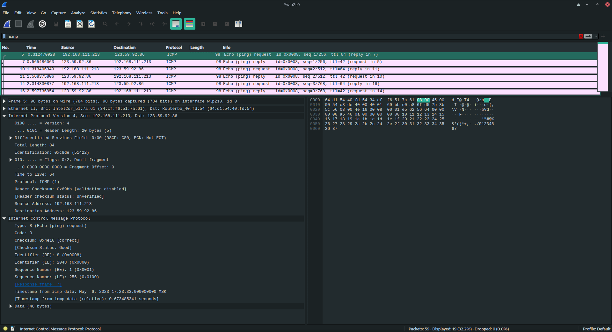
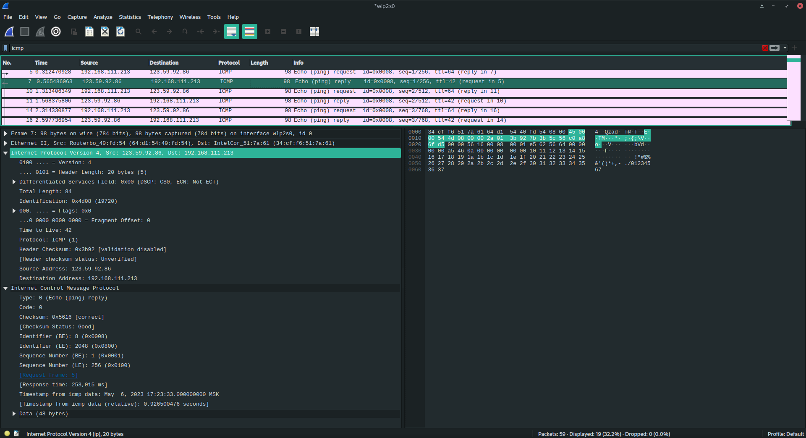
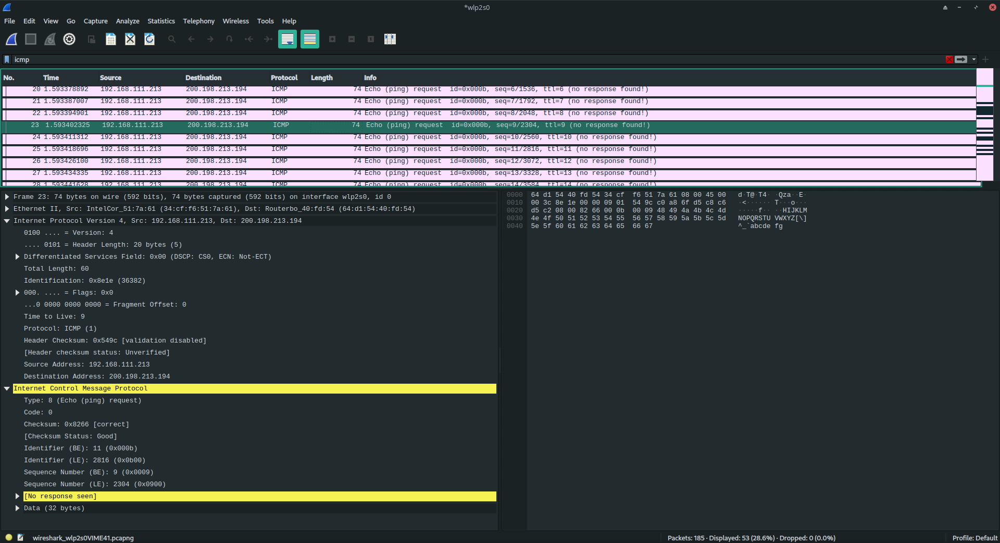
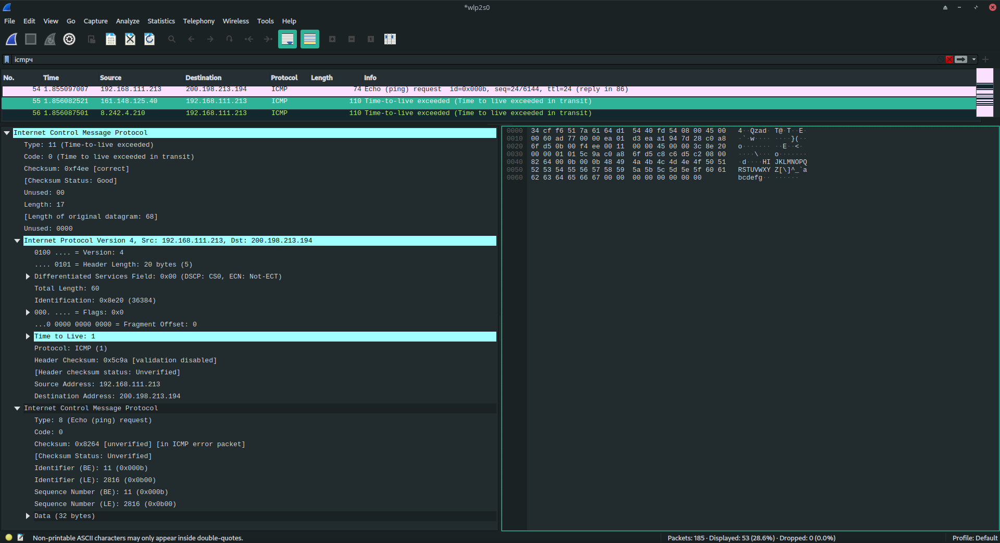
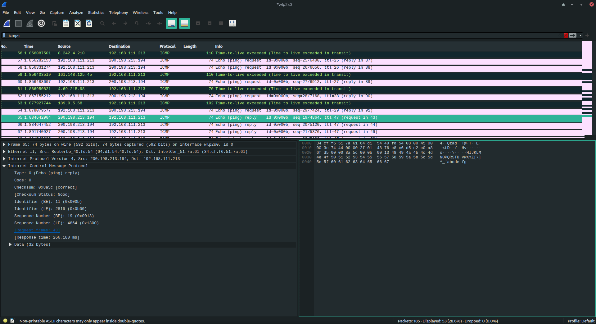
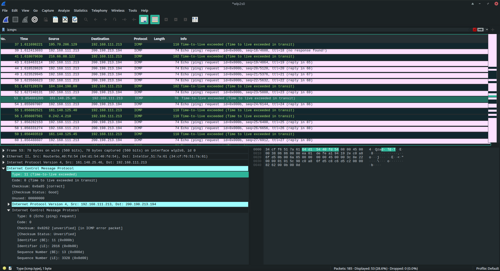
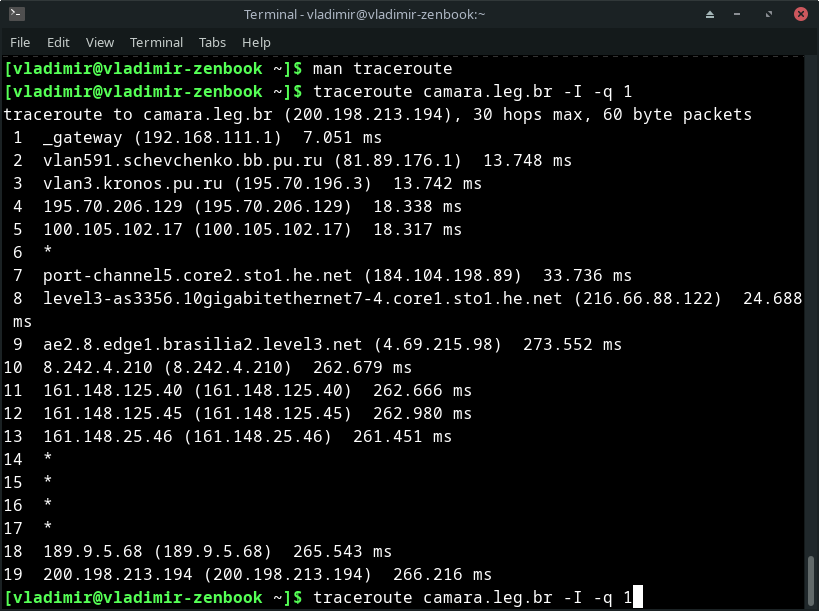

# 1. Wireshark: ICMP

## 1. Ping (4 балла)

`ping -c 10 chinesetest.cn`

### 1)

IP моего компьютера - `192.168.111.213` 

IP хоста назначения - `123.59.92.86`

### 2)

ICMP всегда использует порт `1`

`Protocol: ICMP (1)`

### 3)

`Type: 8 (Echo (ping) request)`

`Code: 0`

----

`Checksum: 0x4e16 [correct]`

`Identifier (BE): 8 (0x0008)`, `Identifier (LE): 2048 (0x0800)` - это одно поле

`Sequence Number (BE): 1 (0x0001)`, `Sequence Number (LE): 256 (0x0100)` - это одно поле

`Timestamp from icmp data: May  6, 2023 17:23:33.000000000 MSK`

`Data (48 bytes)`

---

Контрольная сумма - 2 байта

Порядковый номер - 2 байта

Идентефикатор - 2 байта

### 4)

`Type: 0 (Echo (ping) reply)`

`Code: 0`

---

`Checksum: 0x5616 [correct]`

`Identifier (BE): 8 (0x0008)`, `Identifier (LE): 2048 (0x0800)`

`Sequence Number (BE): 1 (0x0001)`, `Sequence Number (LE): 256 (0x0100)`

`Timestamp from icmp data: May  6, 2023 17:23:33.000000000 MSK`

`Data (48 bytes)`

--- 

Контрольная сумма - 2 байта

Порядковый номер - 2 байта

Идентефикатор - 2 байта

## 2. Traceroute (4 балла)

`traceroute camara.leg.br -I -q 1`

### 1)

WireShark не смог найти ответ на этот запрос

`Data (32 bytes)` - размер данных другой

Кроме того, что у IP части TTL растёт от 1

### 2)

`Unused: 00`

`Length: 17`

`Unused: 0000`

`Internet Protocol Version 4, Src: 192.168.111.213, Dst: 200.198.213.194` - IP-заголовок сообщения которое пришло в маршрутизатор с `TTL=1`

`Internet Control Message Protocol` - ICMP сообщение пришедшее в этот маршрутизатор под тем IP-заголовком

### 3)

У всех было - `Type: 11 (Time-to-live exceeded)`

У последних - `Type: 0 (Echo (ping) reply)`

Для них Wireshark определил на какие запросы они отвечают

Сообщения об ошибках посылают промежуточные маршрутизаторы из-за истичения TTL, в то время как последние сообщения это ответы на запросы от сервера к кторому мы их посылали

### 4)

Между приходом пакетов 51 и 53 (по нумерации сниффера) прошло 200 ms

`Sequence Number (BE): 8 (0x0008)`

`Sequence Number (BE): 9 (0x0009)`

То же самое в traceroute между 8 и 9 задержка около 200 ms

Вероятно этот канал - оптоволокно между Европой и Бразилией

